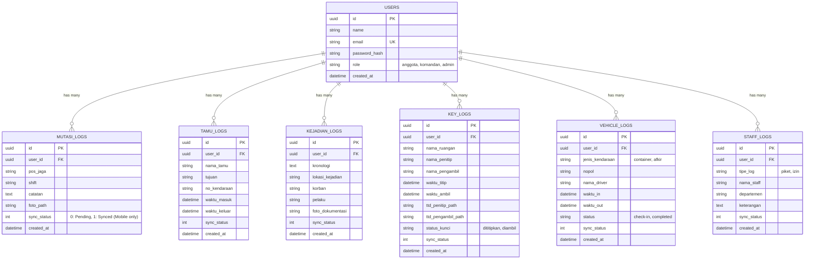

# PRD — Project Requirements Document: Aplikasi E-Satpam Terpadu

## 1. Overview
Aplikasi E-Satpam bertujuan untuk mendigitalkan pencatatan aktivitas, pelaporan, dan buku saku harian petugas keamanan (Satpam) yang sebelumnya dilakukan secara manual. Masalah utama yang ingin diselesaikan adalah risiko kehilangan data logbook fisik, lambatnya eskalasi laporan kejadian, dan kendala pelaporan di area minim sinyal (blank spot).

Tujuan utama aplikasi ini adalah menyediakan platform *mobile* terpadu bagi petugas keamanan untuk mengelola 8 jenis operasional harian, memastikan integritas data melalui sistem *offline-first*, dan memberikan visibilitas *real-time* kepada komandan atau supervisor saat koneksi tersedia.

## 2. Requirements
Berikut adalah persyaratan tingkat tinggi untuk pengembangan sistem E-Satpam:
* **Aksesibilitas:** Aplikasi utama harus dapat diakses melalui perangkat *Mobile* (Android/iOS) oleh petugas di lapangan. Sistem manajemen/dashboard diakses via Web Browser oleh Admin/Supervisor.
* **Pengguna:** Sistem dirancang untuk multi-pengguna dengan *role* berjenjang (Anggota Satpam, Komandan Regu, dan Admin/Supervisor).
* **Data Input:** Input data dilakukan melalui pengetikan form, pengambilan foto (dokumentasi), dan *Digital Signature* (khusus modul penitipan kunci).
* **Spesifisitas Data:** Sistem wajib mengimplementasikan UUID sebagai *Primary Key* di semua entitas untuk mencegah konflik data saat sinkronisasi, serta mencatat status sinkronisasi (`sync_status`) pada setiap baris data lokal di perangkat genggam.
* **Notifikasi & Indikator:** Peringatan status pengiriman data (Pending/Synced) ditampilkan secara visual (ikon *cloud* coret/spinner atau centang hijau) di halaman riwayat. Notifikasi *toast* digunakan saat data berhasil disimpan secara *offline*.

## 3. Core Features
Fitur-fitur kunci yang harus ada dalam versi pertama (MVP):
* **Dashboard Utama (Home):**
    * Header profil petugas dan status *shift*.
    * *Daily Briefing*: Pengumuman/instruksi harian dari pusat.
    * Grid Navigasi ke 8 Modul Pelaporan.
* **Alur UI *History-First*:**
    * Saat modul dipilih dari Home, aplikasi tidak langsung membuka form input. Aplikasi akan menampilkan daftar riwayat (*History*) pelaporan pada hari/shift tersebut beserta indikator sinkronisasinya.
    * Tombol "Tambah/Input" (misal: *Floating Action Button* `+`) tersedia di dalam halaman riwayat ini untuk memulai input data baru.
* **8 Modul Pelaporan Utama:**
    * Lembar Mutasi, Buku Tamu, Laporan Kejadian, Key Log (Penitipan Kunci), Piket Staff, Container, Muat Afkir, dan Izin Staff.
* **Sistem *Offline-First* & *Background Sync*:**
    * Form yang disubmit akan langsung disimpan di *database* lokal (*pending*) tanpa memblokir layar dengan *loading* yang lama.
    * *Background worker* akan otomatis mendeteksi koneksi internet dan melakukan proses sinkronisasi (POST data antrean ke *server*), lalu mengubah status lokal menjadi *synced*.

## 4. User Flow
Alur kerja komprehensif bagi Satpam saat menggunakan aplikasi:
1. **Login:** Petugas masuk menggunakan kredensial akun.
2. **Monitoring Awal:** Petugas membaca *Daily Briefing* di halaman Home.
3. **Aktivitas Pencatatan (Contoh: Laporan Tamu):**
    * Petugas menekan menu "Buku Tamu".
    * Aplikasi menampilkan daftar tamu yang sudah masuk pada hari/shift tersebut (History).
    * Petugas menekan tombol "Tambah Tamu".
    * Petugas mengisi form identitas tamu, tujuan, dan foto, lalu klik Submit.
4. **Penanganan Offline/Online:**
    * Sistem menyimpan data ke memori lokal secara instan. Layar otomatis kembali ke halaman *History* dengan notifikasi *toast* "Data disimpan offline".
    * List terbaru muncul di urutan atas dengan ikon ⏳ (*Pending*).
    * Saat perangkat mendapat sinyal jaringan, sistem otomatis mengirim data ke *server* di latar belakang. Ikon berubah menjadi 🟢 (*Synced*).

## 5. Architecture
Gambaran arsitektur sistem dan aliran data secara teknis dengan pendekatan *Offline-First*:

**Frontend (React Native)** ➔ **Local DB (SQLite + Drizzle)** ➔ **Background Sync Worker** ➔ **Backend API (Laravel)** ➔ **Server DB (MySQL/PostgreSQL)**

**Alur Proses Menambah Laporan (Mode Offline ke Online):**
1. Satpam mengisi form (Teks, Foto, Tanda Tangan).
2. React Native men-*generate* UUID unik untuk log transaksi tersebut.
3. Drizzle ORM menyimpan data ke SQLite lokal dengan status `sync_status = 0` (Pending).
4. Tampilan *History* merender data baru dengan indikator visual *pending*.
5. Modul pendeteksi jaringan (*Network Info*) mendeteksi koneksi internet aktif.
6. Aplikasi mengambil antrean data (`sync_status = 0`) dan mengirimnya via API POST ke Laravel.
7. Laravel (Eloquent) memvalidasi data dan menyimpannya beserta UUID ke *database server*.
8. Laravel mengembalikan status HTTP 200 (Sukses).
9. React Native meng-*update* SQLite lokal menjadi `sync_status = 1` (Synced), dan UI diperbarui (centang hijau).

## 6. Database Schema & Relational Structure
Sistem database ini berlaku simetris antara SQLite (Mobile/Lokal) dan PostgreSQL/MySQL (Backend/Server). Semua entitas dihubungkan menggunakan relasi **One-to-Many (1:N)** dengan `UUID` sebagai kunci utama.

Berikut adalah *Entity Relationship Diagram* (ERD) dari struktur database utama:

## 7. Design & Technical Constraints
Sistem ini harus dibangun dengan standar kualitas perangkat lunak tingkat *enterprise*, mengedepankan ketahanan, keamanan, dan pengalaman pengguna (*UX*) yang mulus.

### 7.1. Frontend Architecture (React Native)
* **Framework & Struktur:** Menggunakan React Native (CLI atau Expo Bare Workflow). Wajib mengimplementasikan *Feature-Based Architecture* (Domain-Driven Design).
* **State Management:** Wajib menggunakan **Zustand** untuk *global state* (seperti profil user dan *theme*) karena ringan dan tidak membebani performa memori.
* **Form Handling & Validation:** Gunakan **React Hook Form** dikombinasikan dengan **Zod** atau **Yup** untuk memvalidasi input sebelum disimpan ke database lokal (mencegah *error* saat nanti dikirim ke *backend*).
* **Navigation:** Menggunakan **React Navigation** (kombinasi *Bottom Tabs* untuk menu utama dan *Native Stack* untuk kedalaman form/detail).
* **File Management:** Foto dan Tanda Tangan harus dikompresi (maksimal 1MB) sebelum disimpan ke *local storage device* (menggunakan `react-native-fs` atau `expo-file-system`) untuk menghemat ruang memori.

### 7.2. Backend Architecture (Laravel)
* **API Standard:** Membangun RESTful API dengan format respons JSON yang terstandarisasi (menampung `status`, `message`, dan `data`).
* **Authentication:** Menggunakan **Laravel Sanctum** untuk menerbitkan token API yang valid dan aman.
* **File Storage:** API harus bisa menerima *multipart/form-data* atau Base64 untuk *file* media, lalu menyimpannya ke *Local Storage* server atau *Cloud* (seperti AWS S3), dan menyimpan URL-nya di *database*.
* **Rate Limiting:** Terapkan *throttle* pada API *endpoint* untuk mencegah beban berlebih (DDoS) saat banyak perangkat melakukan sinkronisasi secara bersamaan di pergantian *shift*.

### 7.3. Local Database & Background Sync Constraint
* **ORM & Database Lokal:** Kombinasi **SQLite** dan **Drizzle ORM** (TypeScript) di React Native.
* **Primary Key Rule:** HARAM menggunakan Auto-Increment (1, 2, 3...) untuk tabel log aktivitas. Semua ID **wajib** menggunakan standar UUIDv4 yang di-*generate* dari perangkat *mobile* sesaat setelah tombol "Simpan" ditekan.
* **Conflict Resolution:** Karena UUID unik, konflik ID saat sinkronisasi di server nyaris mustahil terjadi. Server Laravel cukup menggunakan fungsi `updateOrCreate` berbasis UUID tersebut.

### 7.4. UI/UX & Visual Guidelines (Unicorn Startup Style)
Aplikasi tidak boleh terlihat kaku seperti aplikasi pemerintahan lama. Harus terasa seperti aplikasi *consumer-grade*.
* **Color Palette:** * *Primary:* Orange (diambil dari warna *brand* GGF Security di *mockup* Figma).
  * *Neutral:* White (Background form), Light Grey (Background screen), Dark Grey (Teks sekunder), Black (Teks primer).
  * *Status:* Red (Alert/Kejadian), Green (Selesai/Synced), Yellow/Amber (Pending).
* **Component States:**
  * Wajib ada *Empty State* (ilustrasi ringan dan teks "Belum ada laporan hari ini") jika halaman riwayat kosong.
  * Gunakan **Skeleton Loaders** (animasi kotak abu-abu berkedip) saat aplikasi sedang mengambil data master dari server, bukan *spinner* yang memblokir layar tengah.
* **Typography Rules:**
  * **Primary (Sans-Serif):** `Inter`, `Plus Jakarta Sans`, atau `Proxima Nova`. Digunakan untuk seluruh navigasi, *heading*, label form, dan *body text*.
  * **Secondary / Log Data (Mono):** `JetBrains Mono` atau `Fira Code`. **Hanya** digunakan untuk menampilkan data persisi tinggi seperti: *Nomor Batch, Plat Nomor (Nopol), ID Transaksi, dan Timestamp (HH:MM:SS)* agar lebih mudah diidentifikasi secara visual oleh petugas.